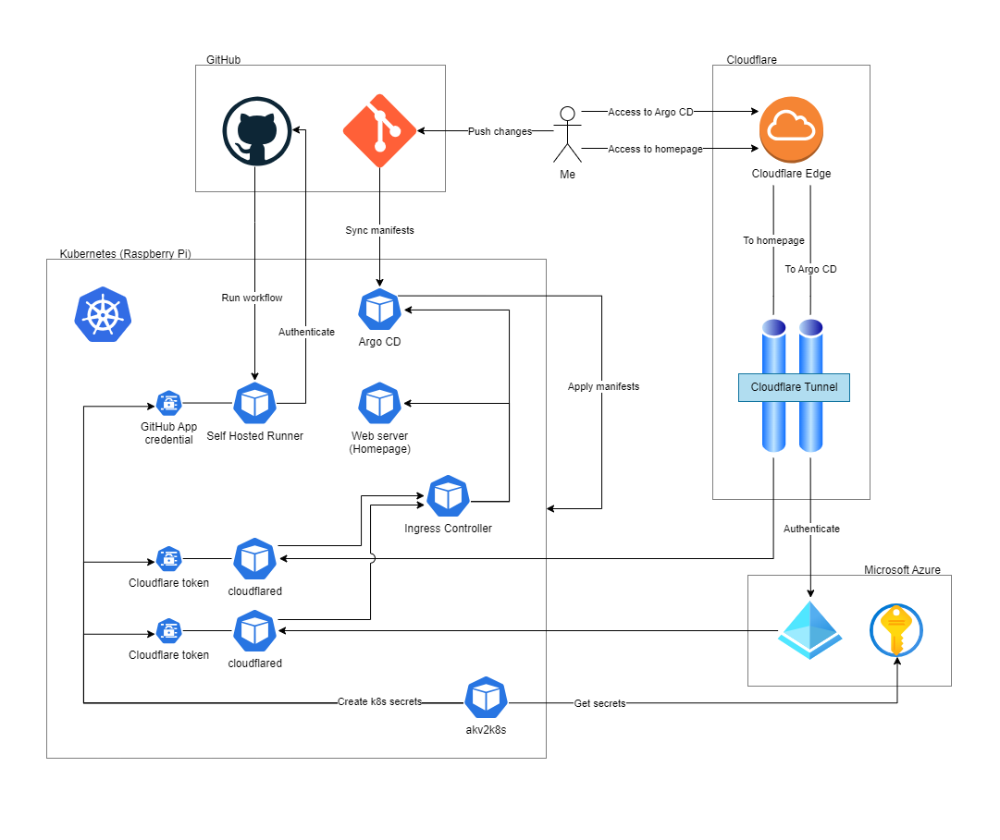
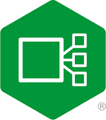

<h1 align="center">Home-Kubernetes</h1>

## Introduction

Welcome to my Home-Kubernetes repository! My Home-Kubernetes cluster is a lightweight, flexible setup designed for middle-scale, personal projects. This setup can be easily adapted to suit various home automation needs, media servers, and other personal services.

Please refer to the [/manifests](/manifests) folder for its details.

## Architecture Diagram

## Components

### [Raspberry Pi 4](https://www.raspberrypi.com/products/raspberry-pi-4-model-b/)

The cluster is composed of three *Raspberry Pi 4* devices, each with 8GB of RAM. One Pi serves as the control plane node, while the other two function as worker nodes. The cluster was set up using Kubeadm on Ubuntu Server 22.04 LTS.

### [Argo CD](https://argo-cd.readthedocs.io/en/stable/)

Self-managed. Manages all applications with the beautiful UI.

### [GitHub Action Runners](https://docs.github.com/en/actions/hosting-your-own-runners/managing-self-hosted-runners/about-self-hosted-runners)

My GitHub Action Runners are self-hosted, run on my Raspberry Pis.
Runner's Dockerfiles are stored in [/gha-runner-images](./gha-runner-images/) folder.

### [akv2k8s](https://akv2k8s.io/)

Fetches Secrets from Azure Key vault and generates K8s Secret resources. Most of applications are relying on this.

### [Ingress-NGINX Controller](https://github.com/kubernetes/ingress-nginx)

The Ingress-NGINX Controller in your Kubernetes cluster directs all incoming web traffic to the correct services, following specific rules. Although it can manage SSL termination, I've chosen to handle that with Cloudflare instead. This decision simplifies the controller's role, allowing it to focus on routing traffic within the cluster without the redundant task of managing SSL certificates, which can help improve the overall efficiency and performance of my setup.

### [cloudflared](https://developers.cloudflare.com/cloudflare-one/connections/connect-networks/get-started/)

Allows me to expose any in-cluster services to the Internet through [Cloudflare Tunnel](https://www.cloudflare.com/products/tunnel/).
