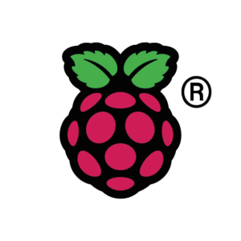
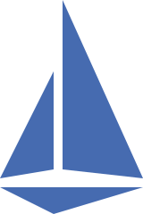

<h1 align="center">Home-Kubernetes</h1>

## Introduction

Welcome to my Home-Kubernetes repository! My Home-Kubernetes cluster is a lightweight, flexible setup designed for middle-scale, personal projects. This setup can be easily adapted to suit various home automation needs, media servers, and other personal services.

Please refer to the [/manifests](/manifests) folder for its details.

## Architecture Diagram

All HTTPS traffics to the cluster are coming through Cloudflare Tunnels. For public contents like homepages it just directly allow to access to the web server. But for protected contents like any management clients such as Argo CD, it requires the user to be authenticated by Azure AD.

## Components

### [Raspberry Pi 4](https://www.raspberrypi.com/products/raspberry-pi-4-model-b/)

The cluster is composed of three *Raspberry Pi 4* devices, each with 8GB of RAM. One Pi serves as the control plane node, while the other two function as worker nodes. The cluster was set up using Kubeadm on Ubuntu Server 22.04 LTS.

### [Argo CD](https://argo-cd.readthedocs.io/en/stable/)

Self-managed. Manages all applications with the beautiful UI.

### [GitHub Action Runners](https://docs.github.com/en/actions/hosting-your-own-runners/managing-self-hosted-runners/about-self-hosted-runners)

My GitHub Action Runners are self-hosted, run on my Raspberry Pis.
Runner's Dockerfiles are stored in [/gha-runner-images](./gha-runner-images/) folder.

### [External Secrets Operator (ESO)](https://external-secrets.io/latest/)

Fetches Secrets from Azure Key vault and generates K8s Secret resources. Most of applications are relying on this. Can work with Workload Identity.

### [Istio Ingress Gateways](https://istio.io/latest/docs/tasks/traffic-management/ingress/ingress-control/)

Quote from the official docs:

> Along with support for Kubernetes Ingress resources, Istio also allows you to configure ingress traffic using either an Istio Gateway or Kubernetes Gateway resource. A Gateway provides more extensive customization and flexibility than Ingress, and allows Istio features such as monitoring and route rules to be applied to traffic entering the cluster.

### [cloudflared](https://developers.cloudflare.com/cloudflare-one/connections/connect-networks/get-started/)

Exposes in-cluster services to the Internet through [Cloudflare Tunnel](https://www.cloudflare.com/products/tunnel/).
